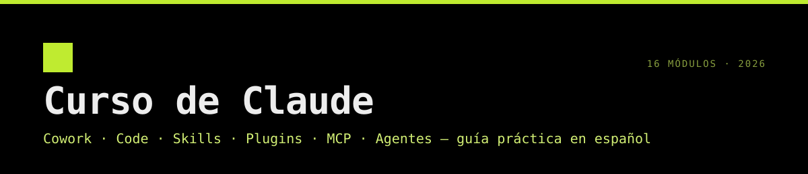

# Masterclass de Claude: Cowork, Code, Skills, Plugins, MCP y Agentes

Curso práctico y en español para dominar el ecosistema de Claude de punta a punta: desde automatizar tareas de oficina con **Claude Cowork**, **Claude en Excel** y **Claude en PowerPoint**, hasta construir y desplegar aplicaciones full‑stack con **Claude Code**, diseñar **equipos de agentes autónomos** y montar tu propio **agente personal** con 10 automatizaciones reales.

---

## Qué vas a lograr

Los objetivos están escritos para ser **medibles**: cada uno dice qué vas a poder hacer, con qué y cómo se comprueba. Cada módulo abre con sus objetivos detallados (formato ABCD, nivel de Bloom y la práctica que los mide). La metodología está en [METODOLOGIA-OBJETIVOS.md](METODOLOGIA-OBJETIVOS.md) y la medición completa en [OBJETIVOS.md](OBJETIVOS.md): **67 objetivos, 9,4/10 de promedio**.

Al terminar el curso vas a poder:

| # | Objetivo del curso | Se mide en | Módulos |
|---|--------------------|------------|---------|
| 1 | **Automatizar** con Claude Cowork tareas reales de finanzas, legal, marketing, datos e investigación, a partir de tus archivos, obteniendo entregables con fórmulas y conclusiones citadas | Prácticas 01 y 03 | 01, 03 |
| 2 | **Construir, depurar y desplegar** con Claude Code una app full‑stack cuyos tests, lint y typecheck pasen antes de publicarla | Proyecto Calorie Tracker | 09, 10 |
| 3 | **Crear** una skill y un plugin propios que se activen cuando corresponde y pasen `claude plugin validate` | Prácticas 03 y 10 | 03, 09, 10 |
| 4 | **Limpiar, analizar y presentar** un dataset con plugins, dejando log de limpieza, estadística con supuestos verificados, dashboard e informe cuyos números coincidan | Prácticas 03 | 03 |
| 5 | **Conectar** Claude con Gmail, Slack, Salesforce u otras herramientas por MCP y ejecutar un flujo entre plataformas con aprobación humana | Práctica 02 | 02, 11 |
| 6 | **Transformar** en Excel, con Claude, una tabla cruda en un dashboard con imputación trazable, formato condicional y fórmulas que se recalculan | Práctica 06 | 06 |
| 7 | **Generar** presentaciones e informes ejecutivos con tu plantilla de marca a partir de datos o investigación, con cifras verificadas contra la fuente | Prácticas 04 y 08 | 04, 08 |
| 8 | **Diseñar** prompts y contextos (6 componentes, técnicas avanzadas, 4 estrategias de contexto) para código, contenido creativo y resolución de problemas | Práctica 05 | 05, 14 |
| 9 | **Construir** modelos financieros profesionales (3 estados, DCF, LBO) con chequeos en verde y sensibilidades | Práctica 07 | 07 |
| 10 | **Orquestar** un equipo de agentes que vaya de la investigación al borrador de email, con subagentes y patrones de orquestación justificados | Práctica y código 11 | 11, 13 |
| 11 | **Elegir** entre subagentes, forks, worktrees, workflows y agent teams según el aislamiento y la coordinación que necesita cada tarea | Autoevaluación 11 y 14 | 11, 14 |
| 12 | **Montar** tu agente personal con memoria en Markdown y al menos 5 automatizaciones programadas o disparadas desde el celular | Prácticas 12 y 13 | 12, 13 |
| 13 | **Usar** las funciones avanzadas de Claude Code, Cowork y Office que no son evidentes (`/goal`, `/rewind`, memoria, skills avanzadas, instrucciones persistentes) | Prácticas 14 | 14 |
| 14 | **Producir** piezas creativas o de nicho (arte, diseño, video, audio, juegos) con skills especializadas y adaptarlas a tu estilo | Prácticas 15 | 15 |

## Temario

| Módulo | Archivo | Contenido |
|--------|---------|-----------|
| 00 | [Introducción y mapa del ecosistema](modulos/00-introduccion.md) | El poder de Claude Code y Cowork, esquema del curso, consejos de éxito |
| 01 | [Claude Cowork: fundamentos](modulos/01-cowork-fundamentos.md) | Qué es Cowork, cómo funciona, demo: organizar archivos y usar la skill de Excel |
| 02 | [MCP, conectores, tokens y ventana de contexto](modulos/02-mcp-conectores-tokens.md) | Model Context Protocol, demo Gmail, tokens, práctica |
| 03 | [Agent Skills y Plugins en Cowork](modulos/03-skills-y-plugins.md) | Skills, demo LinkedIn, plugin de datos (4 partes), plugin de finanzas (3 partes), prácticas |
| 04 | [Claude Chat: investigación, escritura y creatividad](modulos/04-claude-chat.md) | Research, Deep Research, escritura creativa, brainstorming, dashboards, PDF→Excel→PPT |
| 05 | [Prompt Engineering y Context Engineering](modulos/05-prompt-context-engineering.md) | Fundamentos, técnicas avanzadas, context engineering, plantillas |
| 06 | [Claude en Excel](modulos/06-claude-en-excel.md) | Instalación, insights, estadística, gráficos, orden, filtros, formato condicional, imputación |
| 07 | [Modelos financieros nivel Wall Street](modulos/07-modelos-financieros.md) | Forecasting, 3 estados, DCF, LBO, práctica |
| 08 | [Claude en PowerPoint e informes ejecutivos](modulos/08-claude-en-powerpoint.md) | Add‑in, notas del orador, diseño, PDFs→slides, plantillas de marca, coaching; Claude vs Copilot vs NotebookLM |
| 09 | [Claude Code: instalación y fundamentos](modulos/09-claude-code-fundamentos.md) | Desktop, VS Code, terminal, slash commands, CLAUDE.md, gestión de contexto, plugins |
| 10 | [Claude Code: proyectos full‑stack](modulos/10-claude-code-proyectos.md) | Landing pages con/sin skill, slash command de marca, plugin de competencia, Calorie Tracker con IA y Ralph Loops, despliegue |
| 11 | [Agentes de IA, Subagentes y Agent Teams](modulos/11-agentes-subagentes-teams.md) | Agentes 101, MCP 101, frameworks, OpenAI Agents SDK, Claude Agent SDK, agente financiero con memoria, equipos de agentes |
| 12 | [Tu agente personal con Claude Code y Cowork](modulos/12-agente-personal.md) | Arquitectura, patrón Wiki de Karpathy, Obsidian, vault, SOUL.md, CLAUDE.md, carpeta de marca, setup |
| 13 | [Las 10 automatizaciones](modulos/13-automatizaciones.md) | Sprint Tracker, Morning Brief, Market Pulse, Research Team, CRM, Meeting Intel, Email Triage, Expense Wrangler, Content Machine, Weekly Exec Report |
| 14 | [Funciones avanzadas que nadie te cuenta](modulos/14-funciones-avanzadas.md) | `/goal`, `/btw`, `/rewind`, memoria automática, reglas por ruta, `/verify`, skills avanzadas, paralelismo, Cowork y Office en profundidad |
| 15 | [Skills de nicho: arte, diseño y cualquier pasión](modulos/15-skills-de-nicho.md) | 30 skills y plugins verificados para arte generativo, diseño, video, audio, juegos, aprendizaje y creadores |
| — | [Informe de calidad](INFORME-CALIDAD.md) | Revisión con rúbrica: puntajes antes/después, correcciones y verificaciones |
| — | [Metodología de objetivos](METODOLOGIA-OBJETIVOS.md) · [Medición](OBJETIVOS.md) | Cómo se escribieron y midieron los objetivos (ABCD, Bloom, Quality Matters) |
| — | [Skills y plugins del curso](SKILLS-Y-PLUGINS.md) | Qué skills/plugins usa el curso, cuáles ya tenés y cómo instalar el resto |
| — | [Plantillas](plantillas/) | SKILL.md, slash commands, subagentes, plugin de finanzas, SOUL.md, CLAUDE.md |
| — | [Código](codigo/) | Ejemplos de agentes en Python (OpenAI Agents SDK y Claude Agent SDK) |

---

## Cómo usar este curso

1. **Seguí el orden.** Los módulos 00–08 no requieren programar. Los módulos 09–13 usan terminal y algo de código.
2. **Hacé cada práctica antes de mirar la solución.** Cada sección "🧪 Práctica" tiene su "✅ Solución" debajo.
3. **Copiá las plantillas.** La carpeta [`plantillas/`](plantillas/) está lista para pegar en `~/.claude/` o en tu proyecto.
4. **Llevá un diario de prompts.** Guardá los prompts que te funcionaron: se convierten en skills y slash commands.

### Requisitos

- Cuenta de Claude (plan Pro, Max, Team o Enterprise para Cowork, Claude Code y los add‑ins de Office).
- **Claude Desktop** (Mac o Windows) para Cowork.
- Microsoft Excel y PowerPoint (365) para los módulos 06–08.
- Node.js 18+ y Git para los módulos 09–13. Python 3.10+ para el módulo 11.

> ⚠️ **Nota:** las interfaces de Claude cambian rápido. Si un botón o comando tiene otro nombre en tu versión, buscá la función equivalente o escribí `/help` en Claude Code. La lógica y los patrones del curso siguen siendo válidos.

---

Material de estudio preparado con Claude. Paleta y tipografía inspiradas en
<picture>
  <source media="(prefers-color-scheme: dark)" srcset="assets/logo-agency-blanco.png">
  
</picture>

